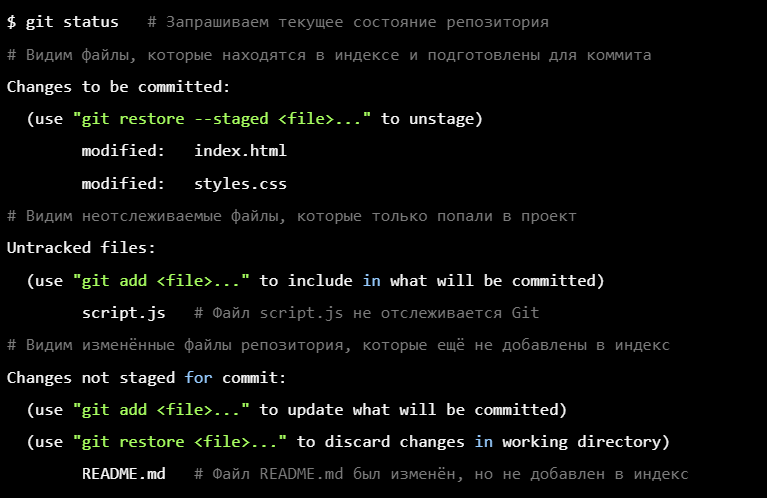

# Коммиты

## Создание коммитов
Git add

Для добавления изменений в коммит используется команда `git add` и имя


## Отправить коммит
```bash
git commit -m "your_message"
```
> git commit - обращение к GIT
>
>-m - добавить сообщение (комментарий)
>
>"your_message" - комментарий (в кавычках)


## Посмотреть список коммитов
* `git log` - стандартный вид
* `git log --graph` - вид с графическим отображением веток

!


## Перейти к сохранению
 ```git checkout```
* ```git checkout <номер коммита, первые 4 символа>``` - перейти к определенному изменению 
* ```git checkout master``` - перейти к изменению последнего коммита 
## Посмотреть есть ли не сохранненные изменения репозитория (файлов)

* ```get status```


## Работа с ветками
* ```git branch``` - посмотреть список веток 
* ```git branch <название ветки>``` - создать ветку (новая ветка унаследует коммиты родительской ветки) 
* ```git checkout <название ветки>``` - перейти на ветку 
* ```git branch -d <название ветки>``` - удалить ветку после merge 
* ```git branch -D <название ветки>``` - удалить ветку принудительно 
* ```git merge <название сливаемой ветки>``` - сливание веток 


